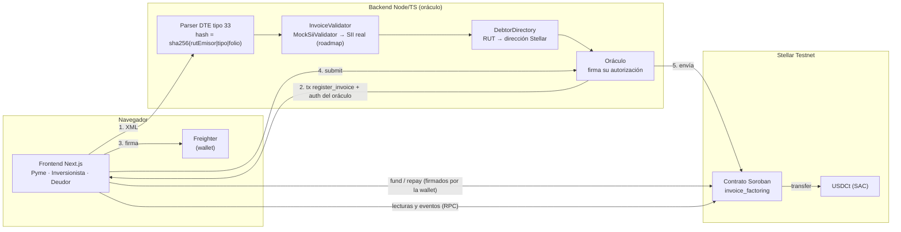
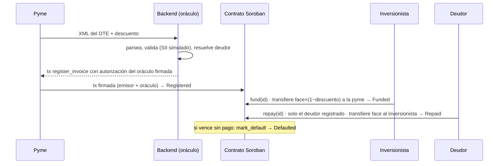

# Arquitectura de CobraFi

## Flujo de una factura

## Estados

`Registered → Funded → Repaid` · `Funded → Defaulted` (si `timestamp > due_date`).

## Decisiones de diseño

| Tema | Decisión |
|---|---|
| Anti doble-cesión | Índice `hash → id` en el contrato; registrar un hash existente falla (`InvoiceAlreadyRegistered`), sin importar quién sea el emisor |
| Privacidad | On-chain solo hash del DTE, montos, fechas y direcciones. Nunca RUT ni razón social |
| Doble autorización | `register_invoice` exige `issuer.require_auth()` y `oracle.require_auth()` |
| Deudor atado | El oráculo atestigua la dirección del deudor al registrar; solo ella puede llamar `repay` |
| Firma sin custodia | El backend nunca ve la clave de la pyme: arma la tx con el emisor como fuente y la wallet firma el sobre |
| Validador enchufable | `InvoiceValidator` permite reemplazar el mock por el SII real o por otros países (CFDI, NF-e) |
| Aritmética | Enteros (`i128`) con `checked_*`; el precio se trunca hacia abajo |
| Tipo de cambio | Referencial y fijo (`CLP_PER_USD`); un oráculo de precios reales es roadmap |

## Limitaciones conocidas (MVP)

- La validación contra el SII es simulada y el directorio de deudores es un mapa fijo.
- Un solo inversionista por factura (el financiamiento fraccionado es un stretch goal).
- `mark_default` no mueve fondos: solo registra la mora on-chain.
- El rendimiento anualizado mostrado es simple (no compuesto).
- Se asume un único token (USDCt) configurado al inicializar el contrato.
